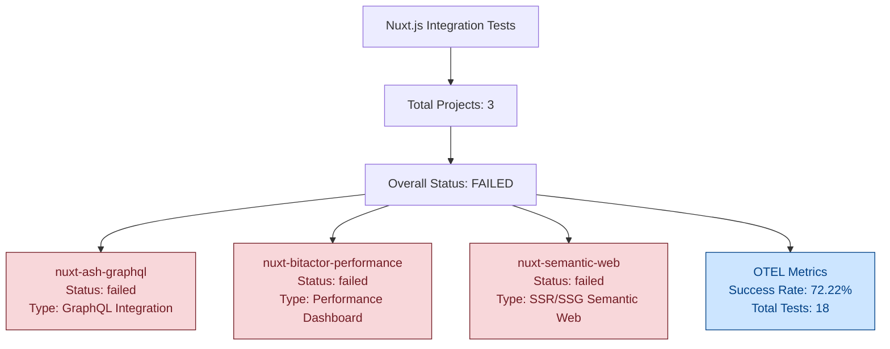

# Nuxt.js Integration Test Results

**Test Run ID:** nuxt_test_1753514298  
**Timestamp:** 2025-07-26T00:18:18.561643  
**Overall Status:** FAILED  

## Test Results Summary



## OTEL Metrics

```json
{
  "span_name": "nuxt_integration_tests",
  "trace_id": "trace_nuxt_test_1753514298",
  "start_time": "2025-07-26T00:18:18.561643",
  "end_time": "2025-07-26T00:18:18.891534",
  "attributes": {
    "test.framework": "nuxt_integration_tester",
    "test.total_projects": 3,
    "test.overall_status": "failed"
  },
  "metrics": {
    "projects_tested": 3,
    "projects_passed": 0,
    "projects_failed": 3,
    "total_tests_run": 18,
    "test_success_rate": 72.22
  },
  "events": [
    {
      "name": "project_test_completed",
      "timestamp": "2025-07-26T00:18:18.891578",
      "attributes": {
        "project.name": "nuxt-ash-graphql",
        "project.status": "failed",
        "project.type": "GraphQL Integration"
      }
    },
    {
      "name": "project_test_completed",
      "timestamp": "2025-07-26T00:18:18.891581",
      "attributes": {
        "project.name": "nuxt-bitactor-performance",
        "project.status": "failed",
        "project.type": "Performance Dashboard"
      }
    },
    {
      "name": "project_test_completed",
      "timestamp": "2025-07-26T00:18:18.891582",
      "attributes": {
        "project.name": "nuxt-semantic-web",
        "project.status": "failed",
        "project.type": "SSR/SSG Semantic Web"
      }
    }
  ]
}
```
