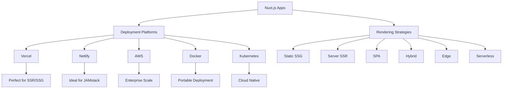

# Nuxt.js Deployment Permutations Report

**Generated:** 2025-07-26T00:20:59.371469

## Overview

This report covers 7 deployment platforms and 6 strategies, providing 8 unique deployment combinations for the CNS Forge Nuxt.js applications.

## Deployment Matrix



## Platform Comparison

| Platform | Complexity | Performance | Cost | Scalability | Best For |
|----------|------------|-------------|------|-------------|----------|


## Strategy Comparison

| Strategy | Description | Best Use Cases |
|----------|-------------|----------------|
| STATIC | Pre-rendered static files for maximum performance | Documentation, Marketing sites, Blogs |
| SSR | Dynamic server-side rendering for real-time data | E-commerce, Dynamic dashboards, User portals |
| SPA | Client-side rendering for interactive applications | Dashboards, Admin panels, Interactive tools |
| HYBRID | Mix of SSR, SSG, and SPA for optimal performance | Complex applications, Mixed content types, Performance optimization |
| EDGE | Rendering at CDN edge locations | Global applications, Real-time features, High traffic sites |
| SERVERLESS | Function-as-a-Service deployment | APIs, Microservices, Event-driven apps |


## Recommendations by Use Case

### Startup Mvp
- **Platform:** Vercel
- **Strategy:** SSR
- **Reason:** Quick deployment, good performance, free tier

### Enterprise App
- **Platform:** Kubernetes
- **Strategy:** HYBRID
- **Reason:** Maximum control, scalability, enterprise features

### Documentation Site
- **Platform:** Netlify
- **Strategy:** STATIC
- **Reason:** Perfect for static content, excellent DX

### Performance Dashboard
- **Platform:** Docker
- **Strategy:** SPA
- **Reason:** Real-time updates, containerized deployment

### Global Saas
- **Platform:** Gcp
- **Strategy:** EDGE
- **Reason:** Global performance, edge computing


## Getting Started

### 1. Choose Your Deployment

Select the appropriate platform and strategy based on your requirements:

- **For quick prototypes:** Vercel + SSR
- **For static content:** Netlify + SSG
- **For enterprise:** Kubernetes + Hybrid
- **For global scale:** GCP + Edge

### 2. Configure Your Project

Each platform includes configuration files in the `deployments/platforms/` directory.

### 3. Deploy

Follow the platform-specific deployment instructions:

#### Vercel
```bash
npm install -g vercel
vercel --prod
```

#### Netlify
```bash
npm install -g netlify-cli
netlify deploy --prod
```

#### Docker
```bash
docker build -t nuxt-app .
docker run -p 3000:3000 nuxt-app
```

#### Kubernetes
```bash
kubectl apply -f k8s-deployment.yaml
```

## Configuration Files

All deployment configurations are available in the following structure:

```
deployments/
├── platforms/
│   ├── vercel/
│   │   └── vercel.json
│   ├── netlify/
│   │   └── netlify.toml
│   ├── aws/
│   │   └── aws-cloudformation.yaml
│   ├── docker/
│   │   ├── Dockerfile
│   │   └── docker-compose.yml
│   └── kubernetes/
│       └── k8s-deployment.yaml
└── deployment_matrix.json
```

## OTEL Monitoring

All deployment configurations include OpenTelemetry monitoring:

- **Metrics:** Request latency, throughput, error rates
- **Traces:** End-to-end request tracing
- **Logs:** Structured application logs

Configure OTEL endpoints in your environment variables:

```bash
OTEL_EXPORTER_OTLP_ENDPOINT=https://your-otel-collector.com
OTEL_SERVICE_NAME=nuxt-cns-forge
OTEL_RESOURCE_ATTRIBUTES=service.version=1.0.0
```

## Support

For deployment assistance:
- Check platform-specific documentation
- Review configuration templates
- Test locally with Docker first
- Monitor deployment with OTEL dashboards

Generated by CNS Forge Deployment Generator v1.0
