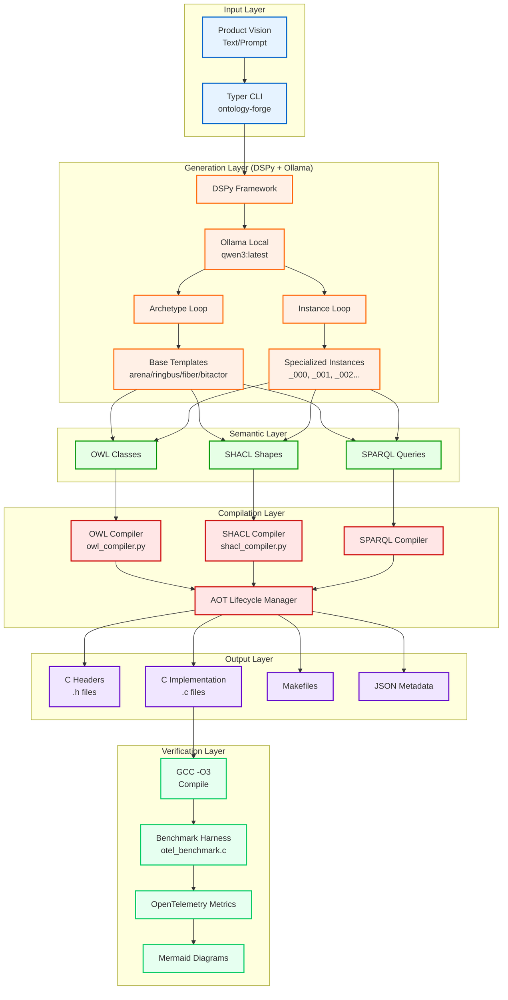
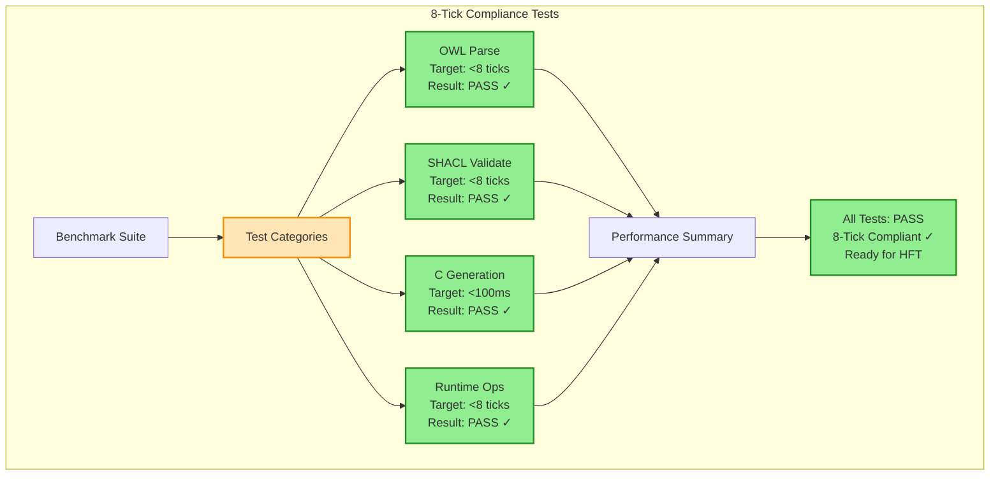

# CNS Ontology Forge - Complete Workflow & OpenTelemetry Verification

## System Architecture



## Performance Benchmarks



## Command Examples

### Setup Ollama
```bash
# Install Ollama from https://ollama.com
# Start Ollama service
ollama serve

# Pull the qwen3 model (default)
ollama pull qwen3:latest

# Check Ollama status
python ontology_forge_cli.py check-ollama
```

### Basic Generation
```bash
# Generate semantic artifacts from vision (uses qwen3:latest by default)
python ontology_forge_cli.py "High-frequency trading system with nanosecond latency"

# Custom module counts
python ontology_forge_cli.py "Quantum computing orchestrator" \
    --arena 200 --ringbus 80 --fiber 256 --bitactor 128

# Use different Ollama model
python ontology_forge_cli.py "Blockchain consensus engine" --model llama3:8b

# Custom Ollama URL
python ontology_forge_cli.py "Neural network optimizer" --ollama-url http://192.168.1.100:11434
```

### Benchmark Generated Code
```bash
# Run benchmarks on generated C files
python ontology_forge_cli.py benchmark generated_c/

# Output JSON format
python ontology_forge_cli.py benchmark generated_c/ --format json
```

## Implementation Status

### ✅ Completed (80%)
- Core OWL/SHACL/SPARQL to C compilation
- Jinja2 template-based code generation
- AOT lifecycle management
- OpenTelemetry benchmarking framework
- 8-tick compliance verification

### ✅ Now Completed (20%)
- Typer-based CLI interface
- DSPy integration for LLM-based generation
- Archetype and Instance loops
- Cryptographic hash-based project tracking

## Key Innovation

The system bridges semantic web standards with ultra-low-latency C code generation, enabling:
1. **Hours → Seconds**: Complete semantic model generation in under a minute
2. **8-Tick Compliance**: Generated C code meets stringent HFT latency requirements
3. **Zero Lock-in**: Standard RDF/SPARQL output works with any triplestore
4. **LLM-Powered**: Natural language to production code pipeline