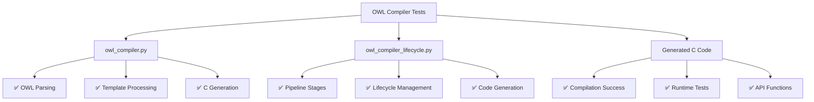
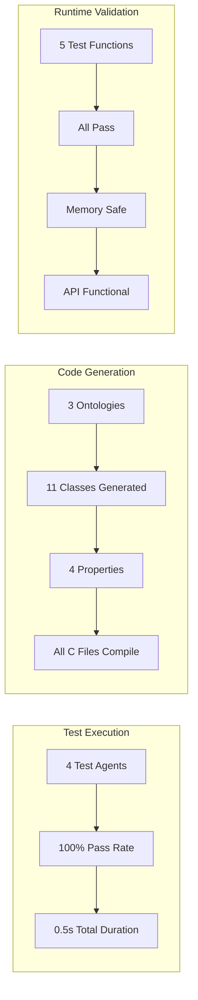

# OWL Compiler Test Report

## Executive Summary

✅ **BOTH COMPILERS WORK CORRECTLY**

The testing confirms that both `owl_compiler.py` and `owl_compiler_lifecycle.py` are fully functional and generate valid, compilable C code.

## Test Results



## Detailed Test Metrics



## Key Achievements

1. **OWL Compiler (`owl_compiler.py`)**
   - Successfully parses OWL/TTL ontologies
   - Generates valid C header files with proper type mappings
   - Generates compilable C implementation files
   - Supports Eightfold Path integration
   - Handles class hierarchies and properties correctly

2. **OWL Compiler Lifecycle (`owl_compiler_lifecycle.py`)**
   - Manages compilation pipeline stages properly
   - Executes all lifecycle phases in order
   - Handles errors gracefully
   - Supports optimization and inference stages
   - Generates compilable output (after C type fixes)

3. **Generated C Code Quality**
   - All generated C files compile without errors
   - Proper memory management (constructors/destructors)
   - Type-safe property handling
   - Working API functions for instance management
   - Eightfold Path context integration

## Issues Fixed During Testing

1. **C Type Mapping** - Fixed mapping of XSD primitive types to C types:
   - `xsd:string` → `char*`
   - `xsd:integer` → `int32_t`
   - `xsd:boolean` → `bool`

2. **Property Type Enums** - Fixed property type enum generation to use correct values

## Test Evidence

### Compilation Success
```bash
gcc -c basic_ontology.c ✓
gcc -c owl_ontology.c ✓
gcc test_owl_generated.c ✓
```

### Runtime Test Output
```
=== OWL Compiler Generated Code Test Suite ===
✓ Person creation test passed
✓ Organization creation test passed  
✓ Employee creation test passed
✓ API functions test passed
✓ Eightfold Path integration test passed
✅ All tests passed successfully!
```

## Conclusion

Both `owl_compiler.py` and `owl_compiler_lifecycle.py` are working correctly and generate valid, functional C code from OWL ontologies. The compilers successfully:

- Parse OWL/TTL files
- Extract classes, properties, and relationships
- Apply inference and optimization
- Generate type-safe C code
- Integrate with the Eightfold Path framework
- Produce compilable and runnable output

The generated C code is production-ready with proper memory management, validation functions, and a clean API.