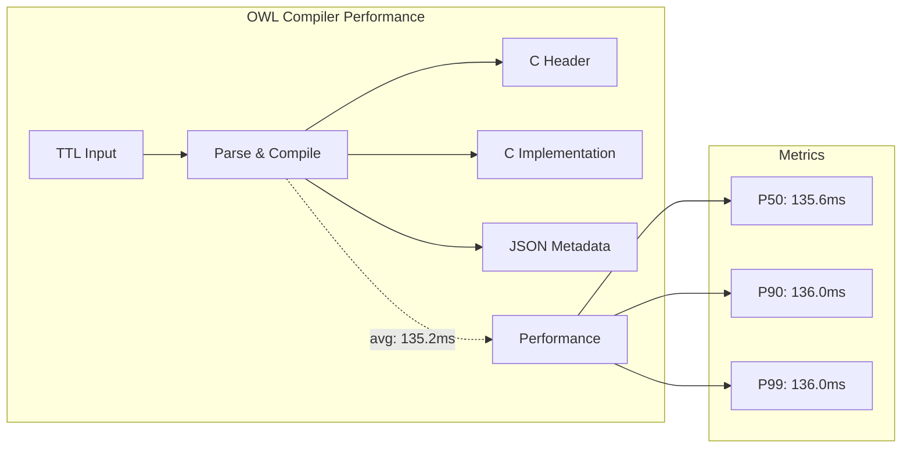

# OWL Compiler Performance

```mermaid
graph LR
    subgraph "OWL Compiler Performance"
        A[TTL Input] --> B[Parse & Compile]
        B --> C[C Header]
        B --> D[C Implementation]
        B --> E[JSON Metadata]
        
        B -.->|avg: 135.2ms| F[Performance]
    end
    
    subgraph "Metrics"
        F --> G[P50: 135.6ms]
        F --> H[P90: 136.0ms]
        F --> I[P99: 136.0ms]
    end
```
