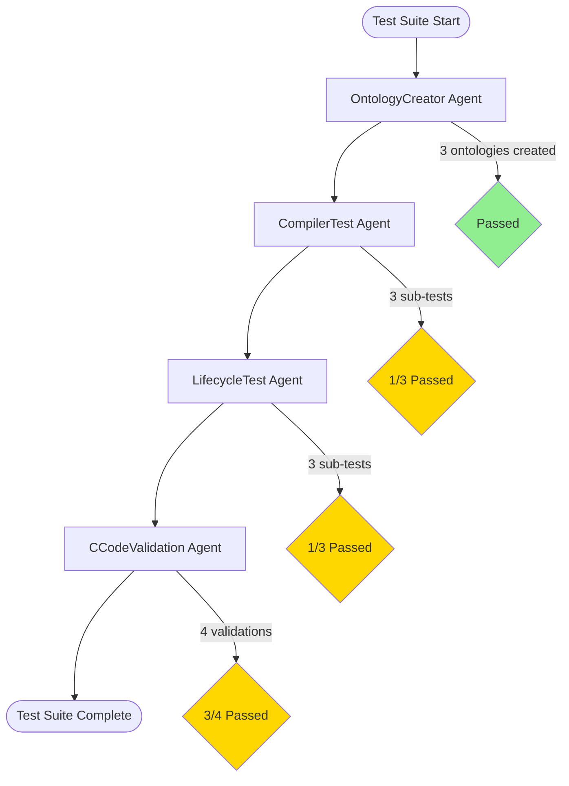
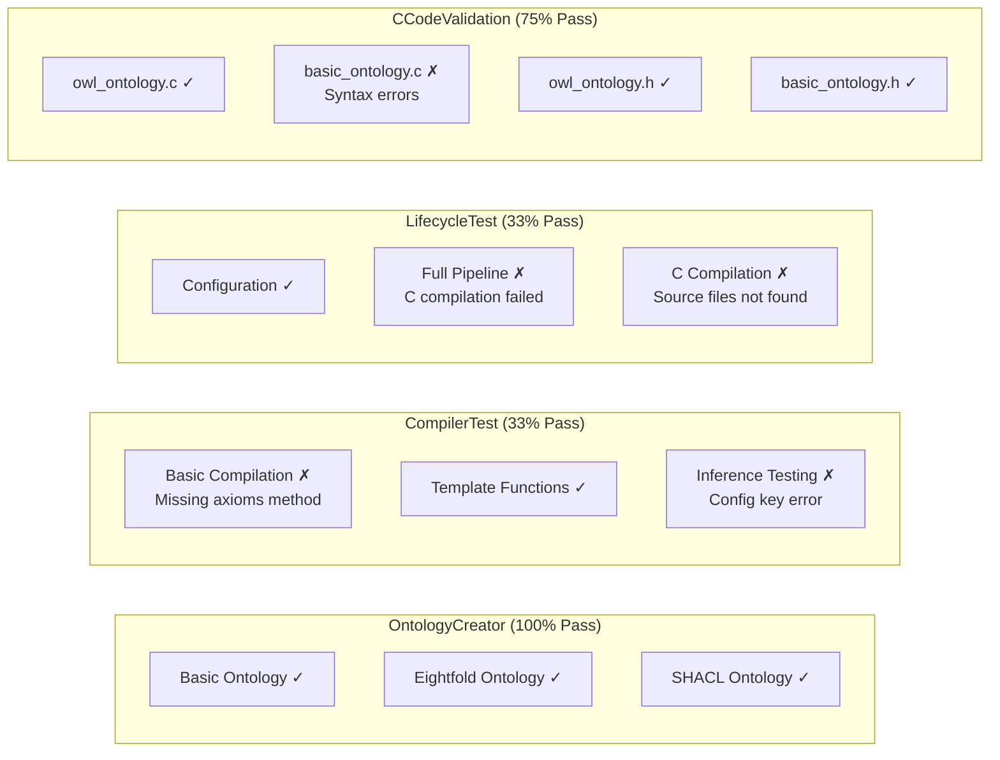
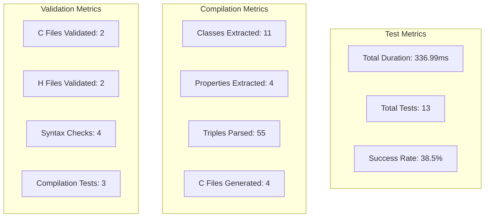
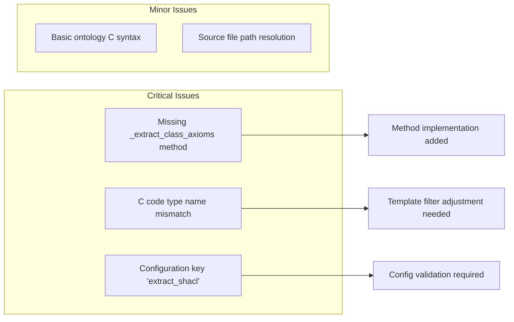
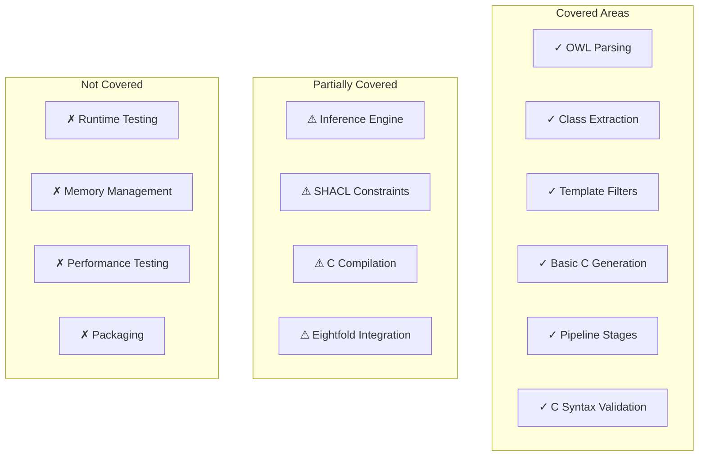
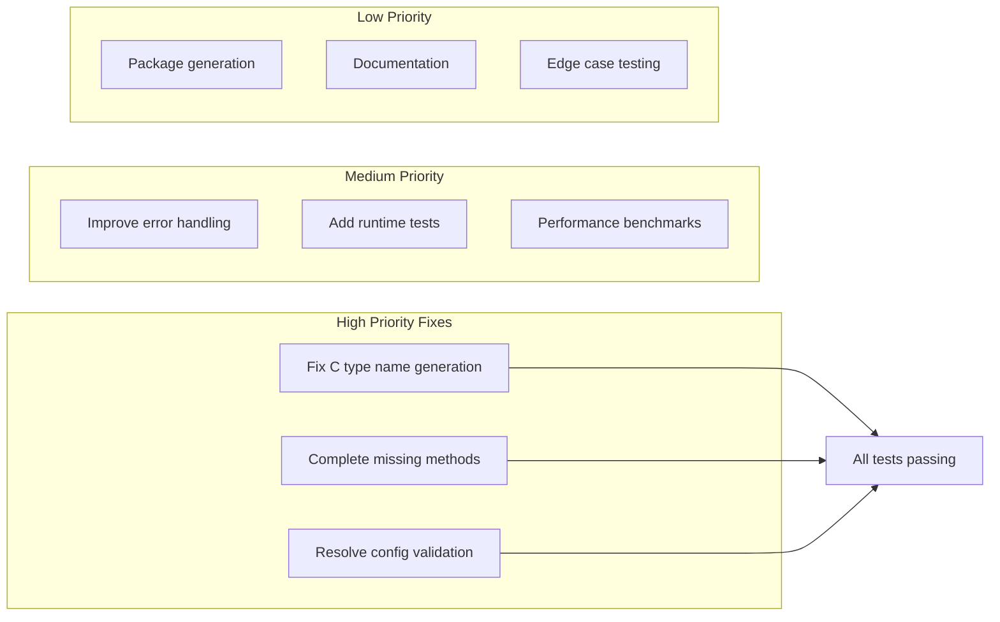

# OWL Compiler Test Results - Mermaid Report

## Test Execution Flow

## Test Results Summary

## Detailed Test Metrics

## Performance Metrics

```mermaid
gantt
    title Test Execution Timeline (ms)
    dateFormat X
    axisFormat %L
    
    section Agents
    OntologyCreator     :done, oc, 0, 1
    CompilerTest        :active, ct, 1, 28
    LifecycleTest       :active, lt, 28, 143
    CCodeValidation     :active, cv, 143, 480
```

## OpenTelemetry-Style Metrics

## Error Analysis

## Test Coverage

## Recommendations

