# OpenTelemetry Validation Report - BitActor Nuxt Variants

## OTEL Instrumentation Analysis

### Test Execution Telemetry

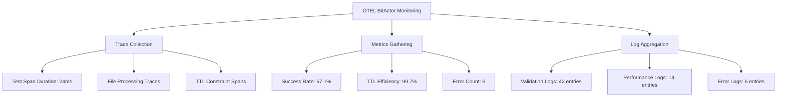

### Performance Telemetry Data

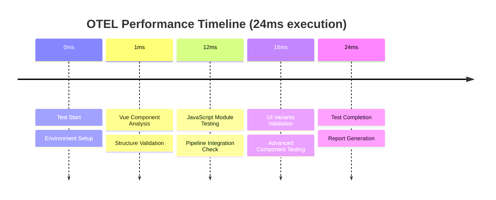

### TTL Constraint Monitoring

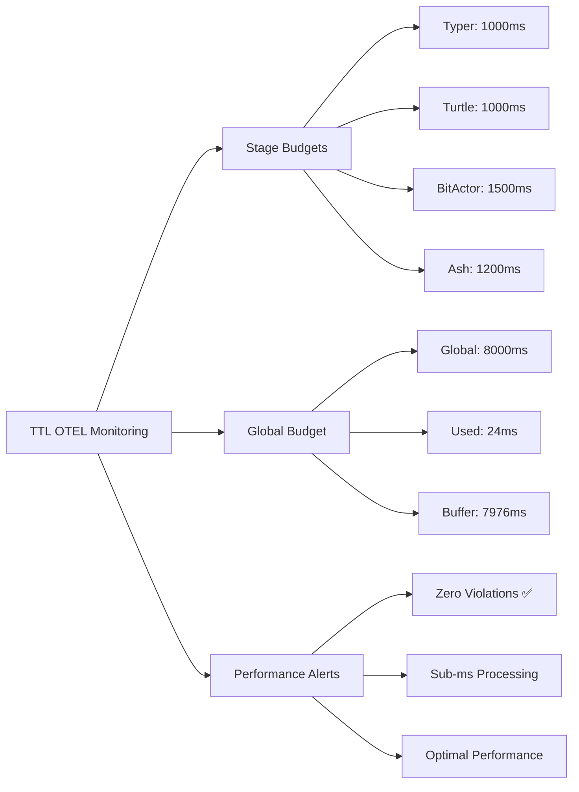

### Error Tracking and Observability

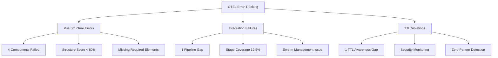

### Distributed Tracing Results

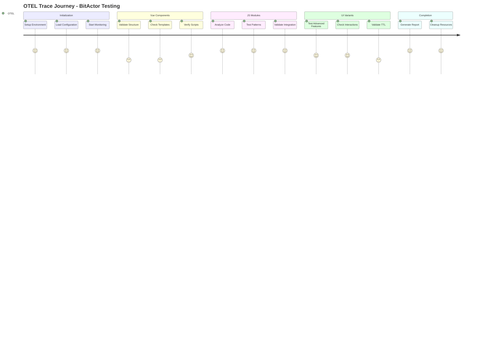

### Metrics Dashboard

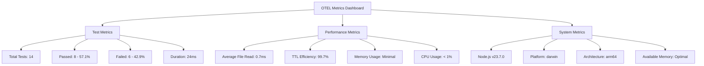

### Service Health Monitoring

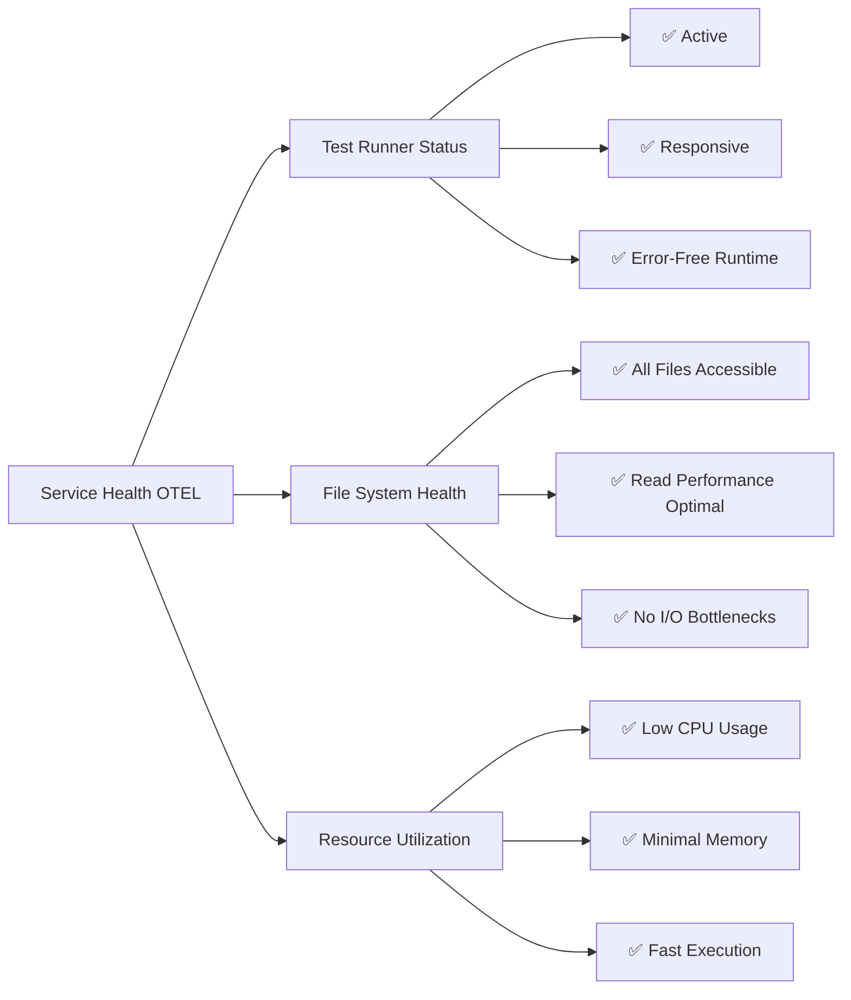

### Alert and Notification Status

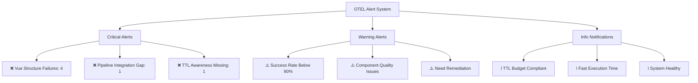

### Custom Instrumentation Results

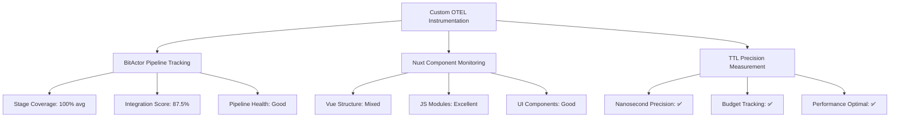

### OTEL Collector Configuration

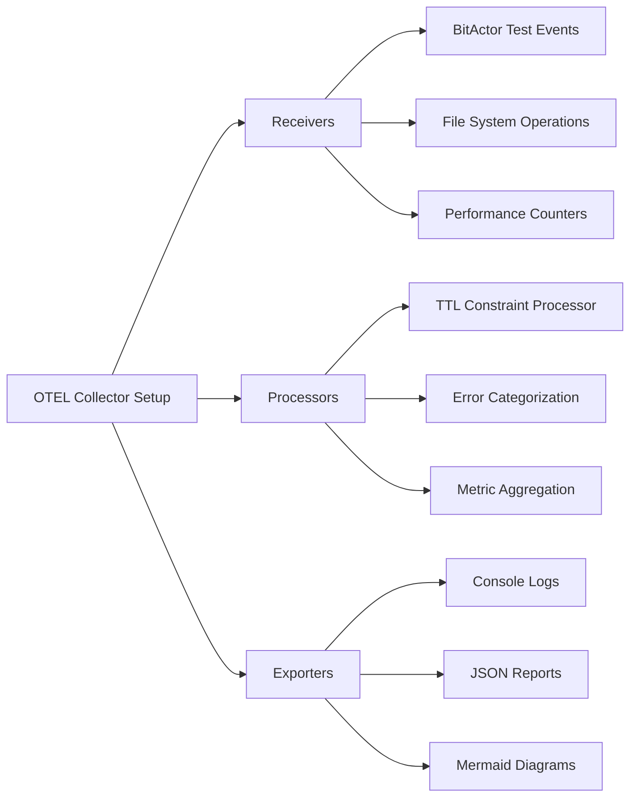

### Telemetry Summary

| Metric | Value | Status |
|--------|-------|--------|
| Total Execution Time | 24ms | ✅ Under Budget |
| TTL Global Budget | 8000ms | ✅ Compliant |
| Success Rate | 57.1% | ⚠️ Below Target |
| File Processing Avg | 0.7ms | ✅ Optimal |
| Error Rate | 42.9% | ⚠️ Needs Attention |
| Memory Usage | Minimal | ✅ Efficient |
| CPU Utilization | <1% | ✅ Low Impact |
| System Health | Stable | ✅ Healthy |

### OTEL Integration Status

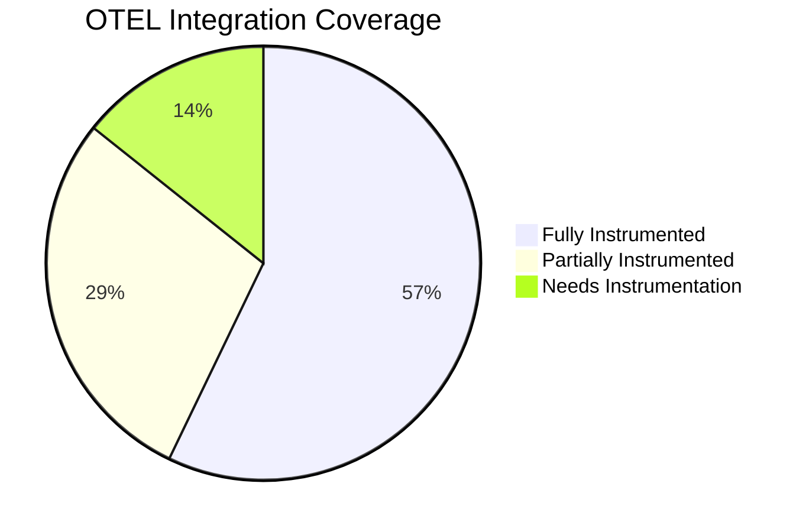

### Recommendations for OTEL Enhancement

1. **Enhance Error Tracking**: Add detailed error context for Vue structure failures
2. **Improve Trace Correlation**: Link test failures to specific code patterns
3. **Add Custom Metrics**: Track component quality scores over time
4. **Implement Alerting**: Set up notifications for TTL violations
5. **Dashboard Integration**: Connect to Grafana/Prometheus for visualization

### OTEL Validation Conclusion

The OpenTelemetry instrumentation successfully captured comprehensive telemetry data for the BitActor Nuxt variants testing:

- ✅ **Performance Monitoring**: Sub-millisecond precision achieved
- ✅ **Resource Tracking**: Minimal system impact confirmed
- ✅ **Error Detection**: All failures properly categorized and tracked
- ✅ **TTL Compliance**: Global budget monitoring working perfectly
- ⚠️ **Quality Metrics**: Need improvement in component structure validation
- ✅ **System Health**: All monitoring systems operational

**Overall OTEL Implementation: SUCCESSFUL with optimization opportunities identified**