# Ultrathink 80/20 Comprehensive Test Report

## Test Execution Summary

```mermaid
graph TD
    A[Ultrathink 80/20 Test Suite] --> B[Unit Tests: 0.0%]
    A --> C[E2E Tests: 0.0%]
    A --> D[Adversarial Tests: 70.0%]
    A --> E[Stress Tests: Completed]
    A --> F[K8s OTEL Tests: 100.0%]
    
    B --> B1[❌ Channel Handler Validation]
    B --> B2[❌ Event Routing Tests]
    B --> B3[❌ TTL Constraint Tests]
    
    C --> C1[❌ Pipeline Flow Tests]
    C --> C2[❌ Workflow Execution]
    C --> C3[❌ Cross-Stage Communication]
    
    D --> D1[✅ Security Posture: 70%]
    D --> D2[✅ Attack Mitigation]
    D --> D3[✅ Vulnerability Detection]
    
    E --> E1[⏳ Load Simulation]
    E --> E2[⏳ Performance Bottlenecks]
    E --> E3[⏳ Scalability Analysis]
    
    F --> F1[✅ OTEL Compliance: 100%]
    F --> F2[✅ Metrics Collection]
    F --> F3[✅ Distributed Tracing]
```

## OTEL Validation Results

## What Doesn't Work - Test Failures

### Critical Failures:

1. **Unit Tests (0% Success Rate)**
   - Channel handler validation failed
   - Event routing pattern detection failed
   - TTL constraint validation failed

2. **E2E Tests (0% Success Rate)**
   - Pipeline flow execution failed (variable naming conflict)
   - Cross-stage communication failed
   - Workflow orchestration failed

## Adversarial Test Results

## K8s OTEL Infrastructure Validation

## OTEL Metrics Coverage

## Distributed Tracing Coverage

## Security Assessment Results

## Infrastructure Readiness Assessment

## Overall Test Results Summary

## Critical Issues Identified

1. **Unit Test Infrastructure Failure**
   - Channel handler pattern detection failed
   - Event routing validation failed
   - Test execution framework issues

2. **E2E Test Execution Errors**
   - Python variable naming conflicts
   - Pipeline simulation failures
   - Integration test failures

3. **Security Vulnerabilities**
   - Buffer overflow protection gaps
   - Race condition vulnerabilities
   - State corruption risks

## Recommendations

### High Priority
1. Fix unit test infrastructure and validation logic
2. Resolve E2E test execution errors
3. Address identified security vulnerabilities
4. Complete stress and benchmark testing

### Medium Priority
1. Enhance OTEL sampling strategies
2. Implement automated compliance monitoring
3. Optimize performance overhead
4. Strengthen error handling

### Low Priority
1. Add property-based testing framework
2. Enhance dashboard visualization
3. Implement advanced alerting
4. Documentation improvements

## Production Readiness Status

**Overall Status: PARTIAL READINESS**

- ✅ **OTEL Infrastructure**: Production ready with 100% validation success
- ⚠️ **Security**: Needs attention - 70% security score with identified vulnerabilities
- ❌ **Testing Coverage**: Critical gaps in unit and E2E testing
- ⏳ **Performance**: Stress and benchmark testing incomplete

**Recommendation**: Address critical testing failures and security vulnerabilities before production deployment.