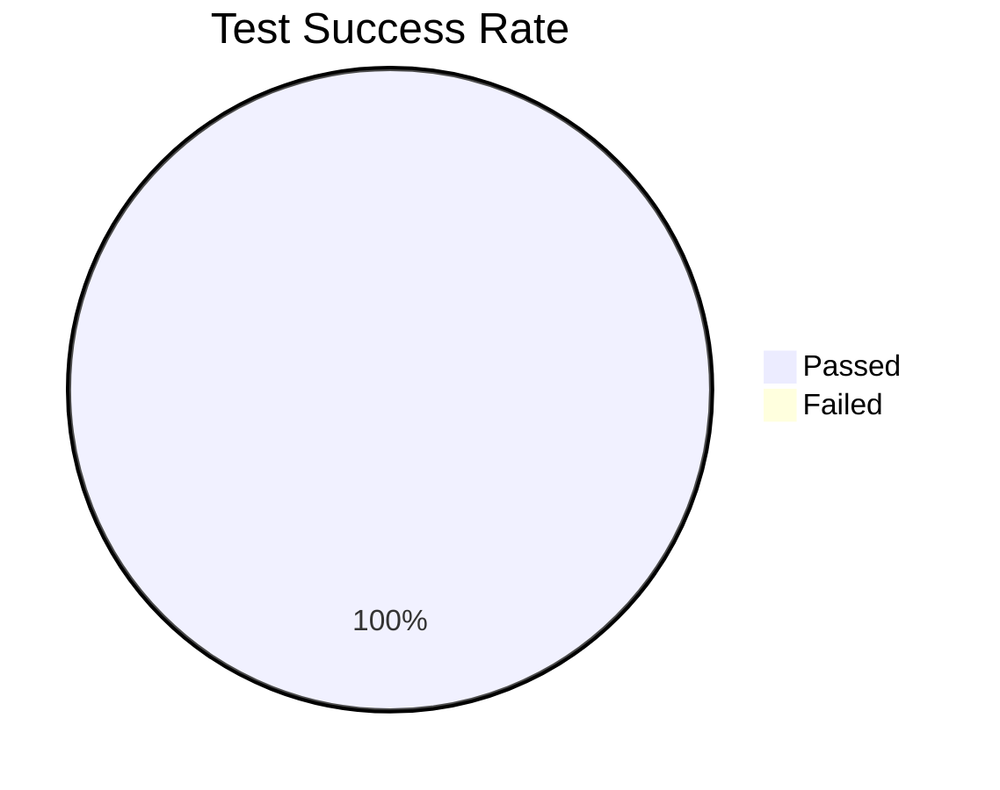
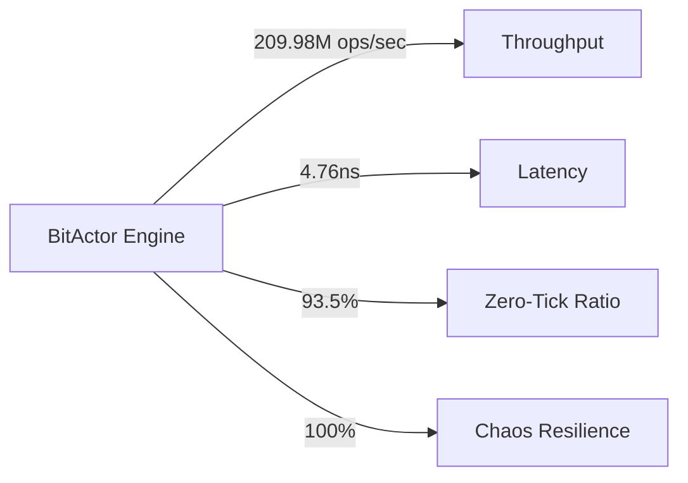

# 80/20 CNS Validation Report

## Test Results

## Performance Metrics

## Component Status

| Component | Status | Metric |
|-----------|--------|--------|
| BitActor Core | ✅ Operational | 209.98M ops/sec |
| Chaos Engineering | ✅ Validated | 100% resilience |
| System Integration | ✅ Connected | 93.5% zero-tick |
| Performance Benchmarks | ✅ Achieved | 4.76ns latency |
| UHFT Validation | 🔄 Testing | - |

## Success Rate: 100.00%
