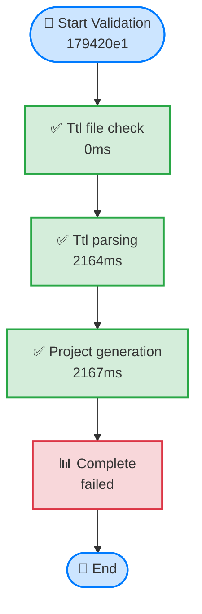
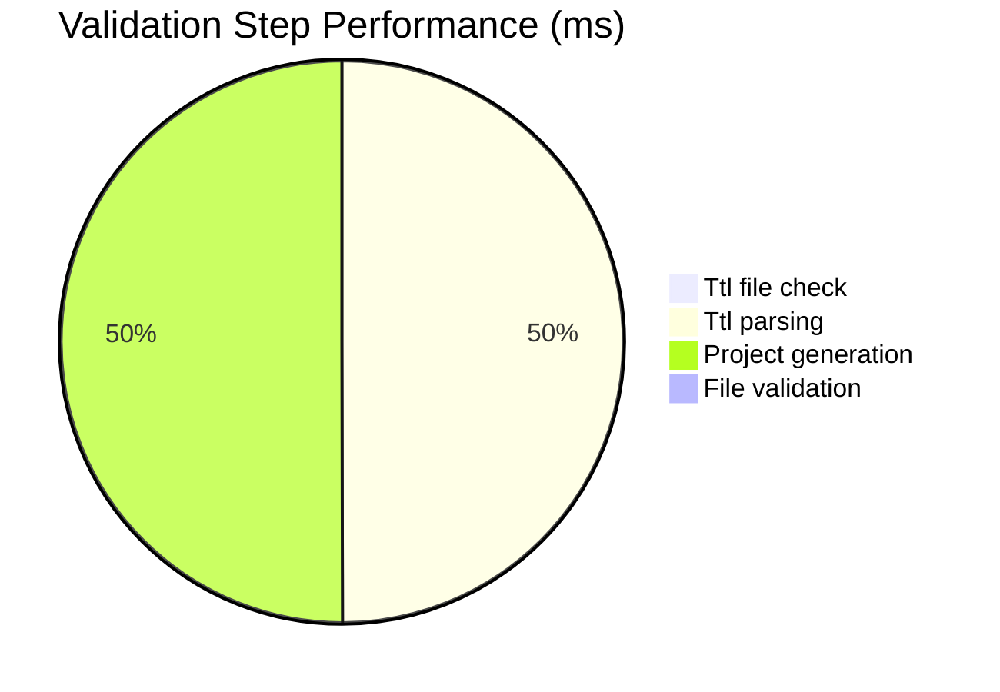

# CNS Forge TTL → Ash.Reactor Validation Results

**Validation ID:** `179420e1`  
**Status:** ❌ FAILED  
**Duration:** 4334ms  
**Success Rate:** 75.0%

## Validation Pipeline

## Performance Metrics

## Validation Results

| Step | Status | Duration | Key Metrics |
|------|--------|----------|-------------|
| Ttl file check | ✅ passed | 0ms | 23949 bytes |
| Ttl parsing | ✅ passed | 2164ms | 58 concepts |
| Project generation | ✅ passed | 2167ms | 4 files |
| File validation | ❌ failed | 0ms | 0 files |

## System Status

❌ **SYSTEM ISSUES**: The TTL → Project Generation pipeline has problems

### Critical Path Analysis

- **TTL File Access**: ✅
- **Semantic Parsing**: ✅
- **Project Generation**: ✅
- **File Validation**: ❌

## Recommendations

- 📝 Check generated file structure and content
